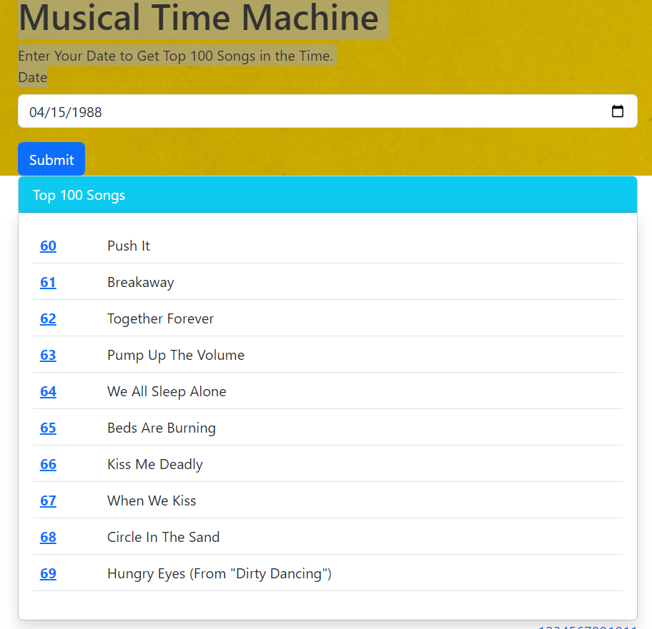

# Musical Time Machine
Musical Time Machine is a Flask web application that scrapes the Billboard Hot 100 chart based on user-provided dates and creates a Spotify playlist with the top 100 songs from that date.

This project utilizes Flask for the web framework, Beautiful Soup for web scraping Billboard's website, and the Spotify API to create playlists dynamically.

## Features
- **Billboard Web Scraping:** Fetches the top 100 songs from the Billboard Hot 100 chart for a specific date.
- **Spotify Integration:** Creates a Spotify playlist based on the fetched songs.
- **Pagination:** Displays the song list with pagination to navigate through the results.
- **User Interaction:** Allows users to input a date to retrieve songs from that specific time.

## Technology Used:
 - Flask
 - Flask-WTF
 - Flask-Bootstrap
 - Flask-Paginate
 - Beautiful Soup
 - Requests
 - Spotipy

## Getting Started
  - **Fork the repository:** You should **fork the repository** and then **clone it** so you can manage your own repo and use this only as a template.
    ```
    $ git clone https://github.com/your_username/your-flask-project.git
    ```
  - **Install dependencies:**
  
    ```
    pip install -r requirements.txt
    ```
  - **Set Environment Variables:** Ensure you have your Spotify API credentials such as 'SPOTIFY_CLIENT_ID', 'SPOTIFY_CLIENT_SECRET' and 'SECRET_KEY' for Flask.
    
  - **Run the Application:**
  
      ```
       python main.py
      ```
  
  - **Access the Application:** Open your web browser and navigate to http://localhost:5000 to access the application.

## Screenshots
 - Home Page:    
   <div align="center"></div>

 - Top 100 Songs on the entered date:    
   <div align="center"></div>

  - Spotify list created automatic:    
   <div align="center"></div> 
   
## Contributing
   Contributions are welcome! Please fork the repository and create a pull request with your changes.
